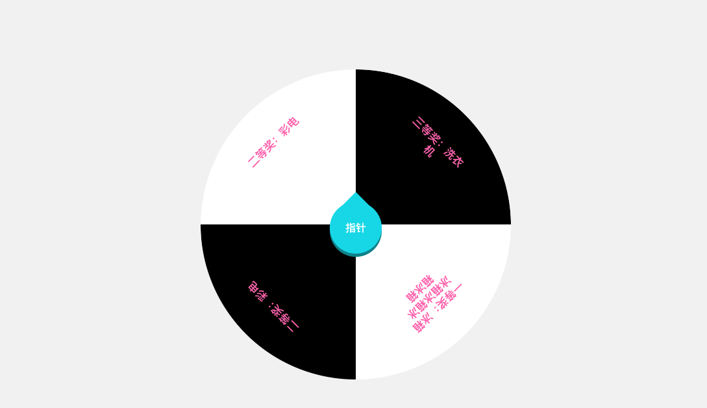
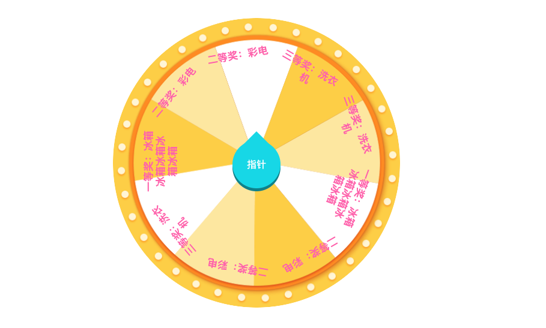
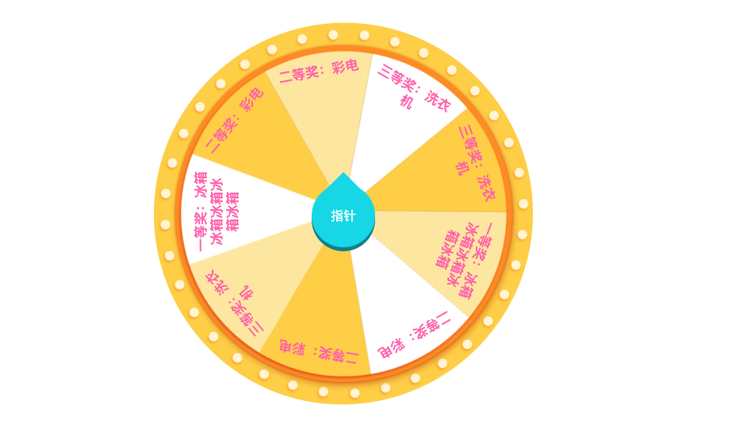
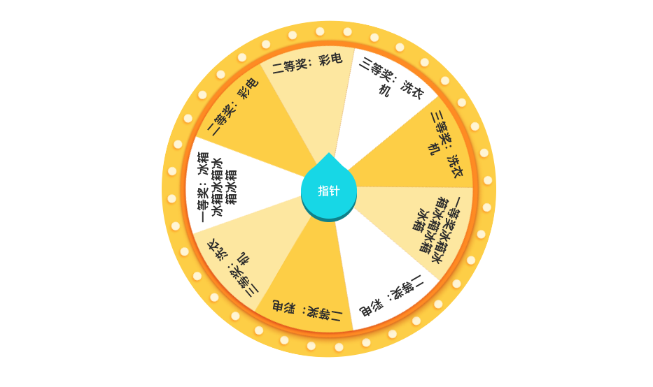
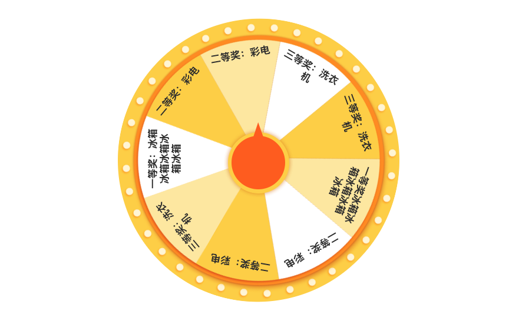

# vue-wheel-drawer


[](https://github.com/RichardLitt/standard-readme)
TODO: Put more badges here.

> Cavas生成的vue抽奖转盘

## Table of Contents

- [vue-wheel-drawer](#vue-wheel-drawer)
  - [Table of Contents](#table-of-contents)
  - [功能介绍](#%e5%8a%9f%e8%83%bd%e4%bb%8b%e7%bb%8d)
  - [安装](#%e5%ae%89%e8%a3%85)
  - [使用](#%e4%bd%bf%e7%94%a8)
    - [注册](#%e6%b3%a8%e5%86%8c)
    - [最基础用法](#%e6%9c%80%e5%9f%ba%e7%a1%80%e7%94%a8%e6%b3%95)
    - [为每个扇形指定背景色](#%e4%b8%ba%e6%af%8f%e4%b8%aa%e6%89%87%e5%bd%a2%e6%8c%87%e5%ae%9a%e8%83%8c%e6%99%af%e8%89%b2)
    - [自定义转盘背景图片](#%e8%87%aa%e5%ae%9a%e4%b9%89%e8%bd%ac%e7%9b%98%e8%83%8c%e6%99%af%e5%9b%be%e7%89%87)
    - [改变字体颜色](#%e6%94%b9%e5%8f%98%e5%ad%97%e4%bd%93%e9%a2%9c%e8%89%b2)
    - [自定义指针](#%e8%87%aa%e5%ae%9a%e4%b9%89%e6%8c%87%e9%92%88)
  - [API](#api)
    - [属性](#%e5%b1%9e%e6%80%a7)
    - [事件](#%e4%ba%8b%e4%bb%b6)
    - [方法](#%e6%96%b9%e6%b3%95)
  - [Maintainers](#maintainers)
  - [Contributing](#contributing)
  - [License](#license)

## 功能介绍

- [x] 只需要奖品列表即可渲染出一个最基础的但功能完整的转盘
- [x] 自定义转盘大小
- [x] 自定义转盘旋转速度
- [x] 自定义转盘旋转时间
- [x] 自定义每一块扇形颜色
- [x] 自定义每一块扇形字体样式（颜色、大小、字体等）
- [x] 自定义扇形中字体的位置
- [x] 自定义转盘指针
- [x] 自定义转盘背景图片

## 安装

```bash
npm i vue-wheel-drawer -D
# yarn add vue-wheel-drawer -D
```

## 使用

### 注册

```js
// 组件内注册
components: {
    wheelDrawer: () => import('../packages/wheel-drawer/src/wheel-drawer'),
},


// 全局注册
import wheelDrawer form 'vue-wheelDrawer'
Vue.use(wheelDrawer)
```

### 最基础用法
传入指定格式的奖品列表`prizeList`（必须有“name”属性）渲染转盘，每个扇形会随机生成一个背景色。
然后通过`pointerClick`接收组件发出的开始抽奖点击事件，再传入奖品的下标调用开始抽奖的方法。
然后通过`rotateOver`接收抽奖完毕事件，做出结果通知。

<details>
<summary>Show Me Code</summary>

```vue
<template>
    <wheel-drawer
        ref="wheelRef"
        :prize-list="prizeList"
        @pointerClick="startHdl"
        @rotateOver="overHdl">
    </wheel-drawer>
</template>

<script>
    data(){
        return {
            prizeList: [
                {
                    name: "一等奖：冰箱冰箱冰箱冰箱冰箱",
                    id: 1,
                },
                {
                    name: "二等奖：彩电",
                    id: 2,
                },
                {
                    name: "二等奖：彩电",
                    id: 2,
                },
                {
                    name: "三等奖：洗衣机",
                    id: 3,
                },
            ],
            prizeIndex: 0,
        };
    },
    methods :{
        startHdl(e) {
            function getRndInteger(min, max) {
                return Math.floor(Math.random() * (max - min + 1) ) + min;
            }
            // 生成随机礼物的下标
            this.prizeIndex = getRndInteger(0, this.prizeList.length-1);

            // 调用组件开始方法，传入下标
            this.$refs.wheelRef.go(this.prizeIndex);
        },
        overHdl() {
            alert(`抽中了【 ${this.prizeList[this.prizeIndex].name} 】`);
        }
    }
</script>
```
</details>


### 为每个扇形指定背景色

为`prizeList`数组中每个对象增加一个`bgColor`属性即可。



```vue
<template>
    <wheel-drawer
        ref="wheelRef"
        :prize-list="prizeList"
        @pointerClick="startHdl"
        @rotateOver="overHdl">
    </wheel-drawer>
</template>

<script>
    data(){
        return {
            prizeList: [
                {
                    name: "一等奖：冰箱冰箱冰箱冰箱冰箱",
                    id: 1,
                    bgColor: "#fff"
                },
                {
                    name: "二等奖：彩电",
                    id: 2,
                    bgColor: "#000"
                },
                {
                    name: "二等奖：彩电",
                    id: 2,
                    bgColor: "#fff"
                },
                {
                    name: "三等奖：洗衣机",
                    id: 3,
                    bgColor: "#000"
                },
            ],
            prizeIndex: 0,
        };
    },
    methods :{
        startHdl(e) {
            function getRndInteger(min, max) {
                return Math.floor(Math.random() * (max - min + 1) ) + min;
            }
            // 生成随机礼物的下标
            this.prizeIndex = getRndInteger(0, this.prizeList.length-1);

            // 调用组件开始方法，传入下标
            this.$refs.wheelRef.go(this.prizeIndex);
        },
        overHdl() {
            alert(`抽中了【 ${this.prizeList[this.prizeIndex].name} 】`);
        }
    }
</script>
```

### 自定义转盘背景图片

自定义转盘背景图的话，通过`bgImg`将背景图传入，这里注意：图片等分扇形的个数应该与奖品列表长度一致。
由于canvas渲染第一个扇形是水平位置开始，所以背景切图可能会与奖品位置错位。通过`bgDeg`调整背景图角度即可。

    

```vue
<template>
    <wheel-drawer
        ref="wheelRef"
        :prize-list="prizeList"
        :bg-img="require('./assets/img/zp2.png')"
        :bg-deg="30"
        @pointerClick="startHdl"
        @rotateOver="overHdl">
    </wheel-drawer>
</template>

<script>
    data(){
        return {
            prizeList: [
                {
                    name: "一等奖冰箱冰箱冰箱冰箱冰箱",
                    id: 1,
                    bgColor: "#fff"
                },
                {
                    name: "二等奖：彩电",
                    id: 2,
                    bgColor: "#000"
                },
                {
                    name: "二等奖：彩电",
                    id: 2,
                    bgColor: "#fff"
                },
                {
                    name: "三等奖：洗衣机",
                    id: 3,
                    bgColor: "#000"
                },
                {
                    name: "一等奖：冰箱冰箱冰箱冰箱冰箱",
                    id: 1,
                    bgColor: "#fff"
                },
                {
                    name: "二等奖：彩电",
                    id: 2,
                    bgColor: "#000"
                },
                {
                    name: "二等奖：彩电",
                    id: 2,
                    bgColor: "#fff"
                },
                {
                    name: "三等奖：洗衣机",
                    id: 3,
                    bgColor: "#000"
                },
                {
                    name: "三等奖：洗衣机",
                    id: 3,
                    bgColor: "#000"
                },
            ],
            prizeIndex: 0,
        };
    },
    methods :{
        startHdl(e) {
            function getRndInteger(min, max) {
                return Math.floor(Math.random() * (max - min + 1) ) + min;
            }
            // 生成随机礼物的下标
            this.prizeIndex = getRndInteger(0, this.prizeList.length-1);

            // 调用组件开始方法，传入下标
            this.$refs.wheelRef.go(this.prizeIndex);
        },
        overHdl() {
            alert(`抽中了【 ${this.prizeList[this.prizeIndex].name} 】`);
        }
    }
</script>
```


### 改变字体颜色



```vue
<template>
    <wheel-drawer
        ref="wheelRef"
        :prize-list="prizeList"
        :bg-img="require('./assets/img/zp2.png')"
        :bg-deg="30"
        :font-color="'#333'"
        @pointerClick="startHdl"
        @rotateOver="overHdl">
    </wheel-drawer>
</template>

<script>
    data(){
        return {
            prizeList: [...],
            prizeIndex: 0,
        };
    },
    methods :{
        startHdl(e) {
            function getRndInteger(min, max) {
                return Math.floor(Math.random() * (max - min + 1) ) + min;
            }
            // 生成随机礼物的下标
            this.prizeIndex = getRndInteger(0, this.prizeList.length-1);

            // 调用组件开始方法，传入下标
            this.$refs.wheelRef.go(this.prizeIndex);
        },
        overHdl() {
            alert(`抽中了【 ${this.prizeList[this.prizeIndex].name} 】`);
        }
    }
</script>
```


### 自定义指针



```vue
<template>
    <wheel-drawer
        ref="wheelRef"
        :prize-list="prizeList"
        :bg-img="require('./assets/img/zp2.png')"
        :bg-deg="30"
        :font-color="'#333'"
        @pointerClick="startHdl"
            
        @rotateOver="overHdl">
    </wheel-drawer>
</template>

<script>
    data(){
        return {
            prizeList: [...],
            prizeIndex: 0,
        };
    },
    methods :{
        startHdl(e) {
            function getRndInteger(min, max) {
                return Math.floor(Math.random() * (max - min + 1) ) + min;
            }
            // 生成随机礼物的下标
            this.prizeIndex = getRndInteger(0, this.prizeList.length-1);

            // 调用组件开始方法，传入下标
            this.$refs.wheelRef.go(this.prizeIndex);
        },
        overHdl() {
            alert(`抽中了【 ${this.prizeList[this.prizeIndex].name} 】`);
        }
    }
</script>
```


## API

### 属性

| 名称 |  说明 | 类型 | 默认值 |
| :-- | :-- | :--| :-- |
| prizeList | 必选。奖品列表,最基本格式：`[{name: "一等奖"}, ...]` | Array | - |
| diam | 转盘直径，也就是转盘大小。 | Number | 478 |
| bgImg | 自定义转盘背景图片。 | String | - |
| bgDeg | 自定义转盘图片的旋转角度。 | Number | - |
| fontColor | 扇形中字体颜色 | String | `#FF69B4` |
| fontWeight | 扇形中字体粗细 | String | `bold` |
| fontSize | 扇形中字体大小 | String | `"17px"` |
| fontFamily | 扇形中文字字体 | String | `"Microsoft Yahei,Helvetica Neue,Tahoma,Arial,PingFangSC-Regular,Hiragino Sans GB,sans-serif"` |
| fontStyle | 设置扇形中字体的`font`属性，也就是文字的大小及样式种类等,通过传递这个属性，可以【更全面】得设置字体样式。与css中的font属性语法相同,[参考](https://developer.mozilla.org/zh-CN/docs/Web/CSS/font)。同时如果传递了这个属性，则会【忽略】：`fonWeight`, `fontSize`, `fontFamily`。 | String | — |
| fontLineWidth | 奖品名称（第一行）的宽度 | Number | 100 |
| sectorPadding | 每个扇形中文字距离扇形弧边的距离 | Number | 65 |
| fontGap | 扇形中每行文字垂直方向的间隔 | Number | 20 |
| rounds | 旋转圈数 | Number | 10 |
| duration | 旋转时长 | Number | `5` |
| timingFn | 旋转动画函数 | String | `"cubic-bezier(0.11, 0.77, 0.2, 0.94)"` |

### 事件

| 名称 | 说明 | 回调参数 |
| :-- | :-- | :-- |
| pointerClick | 指针点击事件。 | - |
| rotateOver | 抽奖完毕，转盘停止转动。 | - |


### 方法

| 方法名  |  说明    |  参数   |
| :-- | :-- | :-- |
| `go` | 转盘转动 | 抽中的奖品位于列表中的下标 |


## Maintainers

- cuoxiaodao

## Contributing

PRs accepted.

Small note: If editing the README, please conform to the [standard-readme](https://github.com/RichardLitt/standard-readme) specification.

## License

MIT © 2019 cuixiaodao


